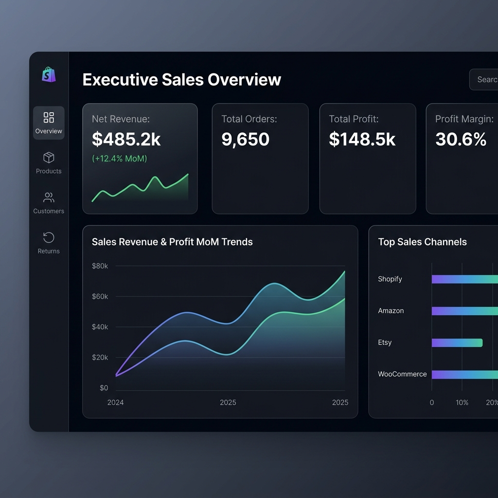
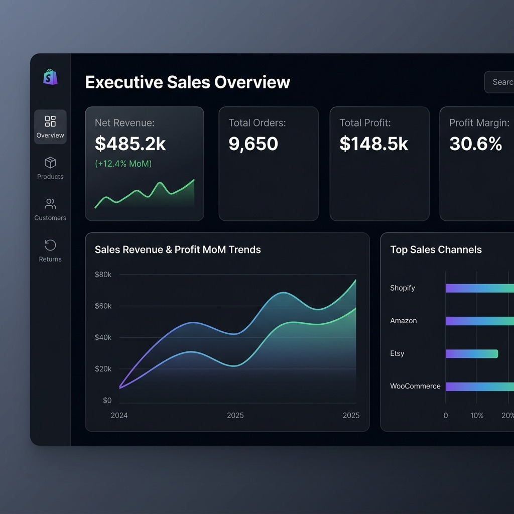
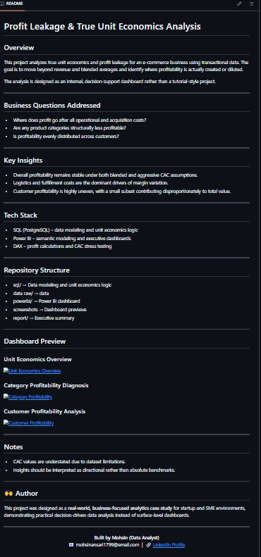

# Profit Leakage & True Unit Economics Analysis

## Overview
This project analyzes true unit economics and profit leakage for an e-commerce business using transactional data. The goal is to move beyond revenue and blended averages and identify where profitability is actually created or diluted.

The analysis is designed as an internal, decision-support dashboard rather than a tutorial-style project.

## Business Questions Addressed
* Where does profit go after all operational and acquisition costs?
* Are any product categories structurally less profitable?
* Is profitability evenly distributed across customers?

## Key Insights
* Overall profitability remains stable under both blended and aggressive CAC assumptions.
* Logistics and fulfillment costs are the dominant drivers of margin variation.
* Customer profitability is highly uneven, with a small subset contributing disproportionately to total value.

## Tech Stack
* **SQL (PostgreSQL)** – data modelling and unit economics logic
* **Power BI** – semantic modelling and executive dashboards
* **DAX** – profit calculations and CAC stress testing

## Repository Structure
* `sql/` -> SQL database schema, load script, transformations, and validation queries.
* `data/` -> Generated synthetic e-commerce dataset (CSV files).
* `Power bi/` -> Power BI project files (`.pbix`).
* `screenshots/` -> Dashboard previews and visualizations.
* `generate_data.py` -> Python script used to synthesize the dataset.
* `.gitignore` -> Git ignore configuration.

## Dashboard Preview

### Unit Economics Overview

### Category Profitability Diagnosis

### Customer Profitability Analysis

## Notes
* CAC values are understated due to dataset limitations.
* Insights should be interpreted as directional rather than absolute benchmarks.

## 👤 Author
This project was designed as a real-world, business-focused analytics case study for startup and SME environments, demonstrating practical decision-driven data analysis instead of surface-level dashboards.

  <strong>Built by Ishan Doshi (Data Analyst)</strong> 
  📧 <a href="mailto:ishandoshiwork@gmail.com">ishandoshiwork@gmail.com</a> | 🔗 <a href="https://www.linkedin.com/in/ishan-doshi-6044b71b3" target="_blank">LinkedIn Profile</a>

